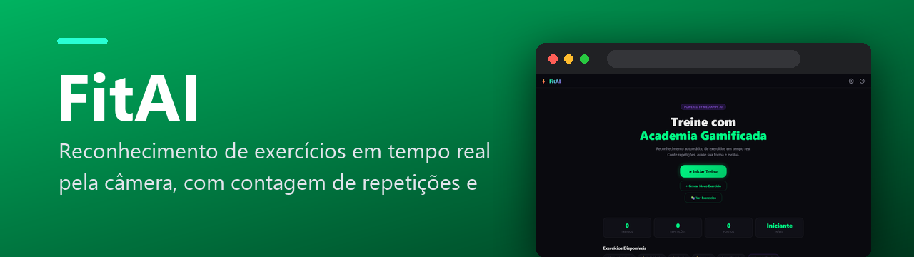

  

  
  
  
  
  
  
  
  

FitAI: reconhece exercícios pela câmera em tempo real, conta repetições, avalia a forma e transforma o treino num jogo — direto no navegador.

  

---

## ✨ O que faz

A câmera do computador vira um *personal trainer*: o FitAI enxerga o seu corpo, entende qual exercício você está fazendo e conta as repetições sozinho.

| | |
|---|---|
| 🦴 **Detecção do corpo** | O **MediaPipe Pose** encontra 33 pontos do corpo e desenha o esqueleto por cima do vídeo |
| 📐 **Ângulos das articulações** | Joelho, quadril, cotovelo... comparados com o padrão de cada exercício |
| 🔢 **Contagem automática** | Detecta a ida e a volta do movimento e conta cada repetição |
| ✅ **Nota da forma (0–100%)** | Com dicas em português do que melhorar |
| 🎥 **Grave seus exercícios** | Ensine um movimento novo e ele passa a ser reconhecido |
| 🧍 **Boneco 3D** | Personagem em **Three.js** demonstra cada exercício (ou reproduz a sua gravação) |
| 🏆 **Treino gamificado** | Pontuação, nível (iniciante → avançado), conquistas e relatório no fim do treino |
| ☁️ **Histórico** | Salvo no **Firebase** (com *fallback* para o navegador se estiver offline) |

## 🚀 Como usar

Abra o [site](https://davicjc.github.io/FitIA/), permita a câmera e escolha um exercício. Funciona no navegador do computador — nada para instalar.

## 📚 Documentação

- [Documentação básica](DOCUMENTACAO_BASICA.md) — o que cada arquivo faz
- [Documentação profunda](DOCUMENTACAO_PROFUNDA.md) — detalhes da detecção e da pontuação

## 🗂️ Estrutura

| Arquivo | O que é |
|---|---|
| `index.html` | todas as telas (início, perfil, treino, relatório, histórico, biblioteca) |
| `js/pose.js` | câmera + MediaPipe + cálculo dos ângulos |
| `js/classifier.js` | o “cérebro”: qual exercício, repetições e nota da forma |
| `js/character3d.js` | boneco 3D |
| `js/report.js` | relatório, nível e conquistas |
| `js/config.js` | Firebase e armazenamento |
| `js/app.js` | controle das telas e do treino |

---

Feito por <a href="https://github.com/Davicjc">Davi Castro</a> · <a href="https://davicjc.com">davicjc.com</a>

